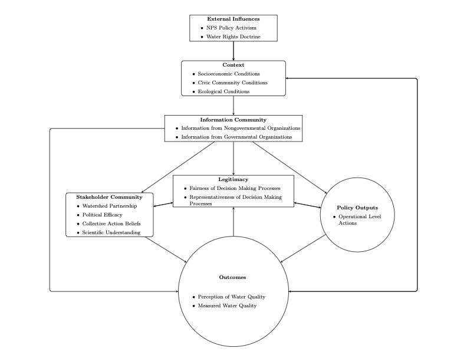

# Slide 2: Lecture Overview

- **Topics:**
  - Understanding Policy Actors
  - Advocacy Coalition Framework (ACF)
  - Institutional Analysis and Development (IAD) Framework
  - Rational Choice Theory
  - Lindblom's Incrementalism
  - Punctuated Equilibrium Theory (PET)
  - Kingdon's Three Streams and Policy Windows

---

# Slide 3: Understanding Policy Actors

- **Who are Policy Actors?**
  - Individuals and groups involved in the policymaking process
- **Types of Actors:**
  - Government officials
  - Interest groups
  - Non-governmental organizations (NGOs)
  - Citizens and stakeholders
- **Importance:**
  - Their interactions shape policy outcomes

---

# Slide 4: Advocacy Coalition Framework (ACF)

- **Key Concepts:**
  - Focuses on the interaction of actors within policy subsystems
  - Actors form coalitions based on shared beliefs and interests
  - Coalitions compete to influence policy over time
- **Components:**
  - **Deep Core Beliefs:** Fundamental worldviews
  - **Policy Core Beliefs:** Domain-specific policy preferences
  - **Secondary Aspects:** Specific policy positions and strategies

---

# Slide 5: ACF Example - Climate Change Policy

| **Pro-mitigation Coalition**       | **Economic Prioritization Coalition**  |
|------------------------------------|----------------------------------------|
| - Environmental NGOs               | - Fossil fuel industry                 |
| - Climate scientists               | - Some labor unions                    |
| - Renewable energy companies       | - Certain policymakers                  |

| **Core Belief**                                                     |
|---------------------------------------------------------------------|
| - Urgent action needed to address climate change (Pro-mitigation)   |
| - Economic growth should not be sacrificed for climate action (Economic Prioritization) |

**Outcome:** Policies reflect the balance of power between coalitions (e.g., Paris Agreement implementation)

---

# Slide 6: Institutional Analysis and Development (IAD) Framework

- **Key Concepts:**
  - Developed by Elinor Ostrom
  - Focuses on how institutions shape actor behavior
  - Institutions provide rules and norms influencing actions
- **Components:**
  - **Action Arena:** Where actors interact
  - **Rules-in-Use:** Formal and informal guidelines
  - **Outcomes:** Results of interactions within the action arena

---

# Slide 7: IAD Example

- **Community-Based Resource Management:**
  - **Situation:**
    - Local fishers managing a common fishing area
  - **Institutions:**
    - Agreed-upon rules for sustainable fishing practices
  - **Action Arena:**
    - Meetings to decide on quotas and enforcement
  - **Outcome:**
    - Sustainable use of the resource benefiting the community

---

# Slide 8: IAD Example from My Research

- **Title:** "Does Collaboration Matter?"
- **Context:**
  - Examined watershed management collaborations
- **Findings:**
  - Collaborative institutions lead to better environmental outcomes
  - Stakeholder engagement enhances policy effectiveness

---

# IAD Example from My Research

---

# Slide 9: Rational Choice Theory

- **Key Concepts:**
  - Focuses on the behavior of individual actors
  - Assumes actors are rational and self-interested
  - Actors seek to maximize their utility (benefits)
- **Implications:**
  - Policies can be designed to align individual incentives with social goals

---

# Slide 10: Rational Choice Example

- **Voting Behavior:**
  - **Assumption:**
    - Individuals will vote if the benefits outweigh the costs
  - **Factors:**
    - Perceived impact of their vote
    - Personal time and effort required
  - **Policy Application:**
    - Making voting easier increases turnout (e.g., mail-in ballots)

---

# Slide 11: Lindblom's Incrementalism

- **Key Concepts:**
  - Proposed by Charles Lindblom
  - Policy changes occur gradually through small adjustments
  - Decision-makers "muddle through" rather than make radical changes
- **Characteristics:**
  - Limited analysis of alternatives
  - Focus on practical solutions over ideal ones

---

# Slide 12: Incrementalism Example - Minimum Wage Policy

## Initial State:
- Federal minimum wage at $7.25/hour

## Incremental Changes:
1. **Year 1:** Increase to $8.00/hour
2. **Year 3:** Increase to $9.00/hour
3. **Year 5:** Increase to $10.00/hour

## Rationale:
- Allows businesses to adapt gradually
- Reduces political opposition
- Provides opportunities for assessment and adjustment

---

# Slide 13: Punctuated Equilibrium Theory (PET)

- **Key Concepts:**
  - Policy change occurs in significant leaps after periods of stability
  - Long periods of incremental change are interrupted by sudden shifts
- **Mechanisms:**
  - **Policy Monopolies:** Established interests maintaining status quo
  - **Triggering Events:** Crises or shifts in public opinion disrupting equilibrium

---

# Slide 14: PET Example

- **Financial Regulation:**
  - **Stability Period:**
    - Minimal regulatory changes before 2008
  - **Triggering Event:**
    - Global financial crisis of 2008
  - **Policy Shift:**
    - Rapid enactment of new regulations like the Dodd-Frank Act

---

# Slide 15: Kingdon's Three Streams and Policy Windows

- **Key Concepts:**
  - Policy change occurs when three streams converge:
    - **Problem Stream:** Recognition of issues needing attention
    - **Policy Stream:** Potential solutions available
    - **Politics Stream:** Political climate and public mood
  - **Policy Window:**
    - Opportunity for change when streams align
- **Role of Policy Entrepreneurs:**
  - Individuals who promote policy changes by coupling streams

---

# Slide 16: Kingdon's Model Example - Telehealth Policy

- **Problem Stream:** 
  - Rural healthcare access issues
  - Rising healthcare costs
- **Policy Stream:**
  - Advances in telemedicine technology
  - Proposals for insurance coverage of telehealth services
- **Politics Stream:**
  - COVID-19 pandemic highlighting healthcare access issues
  - Bipartisan support for telehealth expansion
- **Policy Window:**
  - Rapid adoption of telehealth policies during pandemic
  - Permanent expansion of Medicare telehealth coverage
- **Policy Entrepreneurs:** Advocates for telehealth expansion

---

# Slide 17: Conclusion

- **Summary of Theories:**
  - **ACF:** Coalitions based on shared beliefs influence policy
  - **IAD:** Institutions shape interactions and outcomes
  - **Rational Choice:** Individuals act to maximize personal benefit
  - **Incrementalism:** Policy evolves through small, manageable steps
  - **PET:** Significant changes follow long periods of stability
  - **Kingdon's Model:** Policy change when problem, policy, and politics align
- **Importance:**
  - Understanding these theories aids in analyzing and influencing policy processes

---

# Slide 18: Questions and Discussion

- **Open Discussion:**
  - How do these theories apply to current policy debates?
  - Can you identify examples from recent news?
- **Questions:**
  - What connections did you make between the theories?
  - Which theory do you find most applicable to real-world policy changes or changes in you term paper topic?

